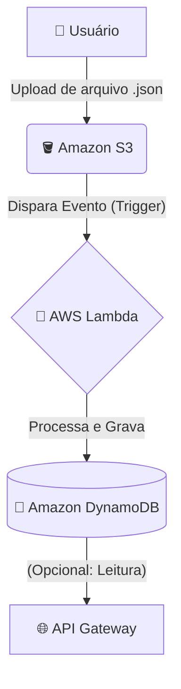

# 🚀 Projeto DIO: Automação Serverless com AWS Lambda e S3

Este repositório é o meu "diário de bordo" do desafio **"Executando Tarefas Automatizadas com Lambda Function e S3"**, parte do incrível bootcamp **Code Girls 2025** da [Digital Innovation One](https://dio.me/).

Mais do que apenas código, este é um registro da minha jornada de aprendizado em arquitetura serverless. O objetivo é documentar o "como" e o "porquê" das coisas, criando um material que sirva de consulta para mim e para qualquer outra pessoa desbravando o mundo AWS. 🤓

---

## 🛠️ Tech Stack (As Ferramentas do Jogo)

Para construir essa solução, utilizamos um conjunto poderoso de serviços da AWS, com um "simulador" local para garantir que tudo funcione sem custos.

---

## 🗺️ A Arquitetura: Onde a Mágica Acontece

O coração deste projeto é uma arquitetura **orientada a eventos** (Event-Driven). Em vez de um servidor esperando comandos, temos serviços que *reagem* a eventos.

**O fluxo é simples, mas incrivelmente poderoso:**

1.  Um **Usuário** faz o upload de um arquivo (no nosso caso, um JSON de nota fiscal) em um "balde" (Bucket) do **Amazon S3**.
2.  O **S3**, ao detectar um novo arquivo, dispara um **evento** (trigger).
3.  Esse evento aciona nossa "função mágica", a **AWS Lambda**.
4.  A **Lambda** (o cérebro 🧠 da operação) lê o arquivo, processa os dados e os grava em uma tabela do **Amazon DynamoDB**.
5.  (Bônus) Esses dados poderiam então ser consumidos por uma API (via **API Gateway**) para alimentar um dashboard ou outro aplicativo.

### Diagrama do Fluxo

Para visualizar melhor, aqui está o fluxo desenhado:

## 💡 Meus Principais Insights e Aprendizados

Este projeto foi uma virada de chave em vários conceitos. Aqui estão minhas maiores lições:

### 1. O Poder do "Serverless" (Lambda)
A AWS Lambda é fascinante. Você sobe o código e ele "apenas funciona" quando é chamado. Não precisei configurar um servidor, me preocupar com escalabilidade (a AWS cuida disso) ou pagar por tempo ocioso. A gente paga *literalmente* pelos milissegundos de execução. Isso muda o jogo.

### 2. S3 é Mais que um "Dropbox"
Eu via o S3 apenas como um lugar para guardar arquivos. Neste projeto, entendi seu poder como um **iniciador de processos**. A integração nativa dele com o Lambda (via triggers) abre um leque infinito de automações: processamento de imagens, análise de logs, ETLs... tudo começa com um simples upload.

### 3. A "Sacada" de Ouro: Testar com LocalStack ✈️
> **Insight Profissional:** "Nunca teste na produção" também vale para custos.

Configurar permissões (IAM), triggers e código na nuvem pode gerar custos (e frustração) a cada tentativa e erro. A maior "sacada" do bootcamp foi usar o **LocalStack**.

Ele é um "simulador de voo" da AWS que roda na sua própria máquina. Pude criar buckets, tabelas e funções lambda localmente, testar todo o fluxo dezenas de vezes e só subir para a AWS real quando tive certeza de que tudo estava funcionando.

**Resultado:** Aprendizado acelerado, zero custos inesperados e muito mais confiança no deploy.

---

## Implementação (O "Como Fazer")

Resumindo a prática, estes foram os passos principais da construção:

1.  **Criar o Bucket S3:**
    * `notas-fiscais-upload` (Onde os arquivos chegam).
2.  **Criar a Tabela no DynamoDB:**
    * `NotasFiscais` (Onde os dados são guardados).
    * Chave Primária: `id` (Para identificar cada nota).
3.  **Criar a Função Lambda:**
    * Implementar a lógica em Python (ou Node.js) para ler o JSON do evento, validar e salvar no DynamoDB.
    * **Ponto Crítico:** Configurar as permissões (IAM Role) para que a Lambda tenha permissão de *ler* do S3 e *escrever* no DynamoDB.
4.  **Criar o Gatilho (Trigger):**
    * Conectar o S3 à Lambda, configurando o bucket para disparar a função sempre que um novo arquivo (`.json`) for criado.

---

## 🔗 Referências Úteis

Para quem quiser se aprofundar, estes são os links oficiais que mais me ajudaram:

* [Documentação AWS Lambda (Developer Guide)](https://docs.aws.amazon.com/lambda/latest/dg/welcome.html)
* [Documentação Amazon S3 (User Guide)](https://docs.aws.amazon.com/AmazonS3/latest/userguide/Welcome.html)
* [Documentação Amazon DynamoDB (Developer Guide)](https://docs.aws.amazon.com/amazondynamodb/latest/developerguide/Welcome.html)
* [LocalStack no GitHub (O salvador de custos!)](https://github.com/localstack/localstack)

Obrigado, [DIO](https://dio.me/) e **Code Girls**, pela oportunidade de construir algo tão relevante para o mercado!